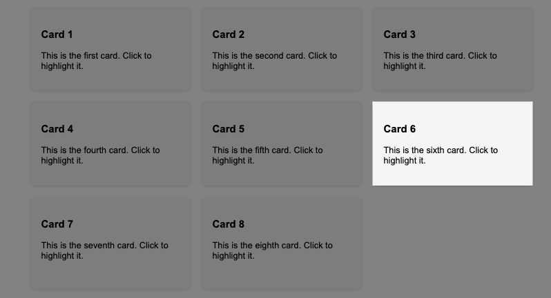

# Iris Out

A lightweight library for highlighting DOM elements by shading everything else on the page.

Checkout the [demo page](nikitindiz.github.io/iris-out/) to see in action.



## Installation

```bash
npm install @nikitindiz/iris-out
```

or

```bash
yarn add @nikitindiz/iris-out
```

## Usage

```typescript
import Iris from '@nikitindiz/iris-out';

// Initialize with default options
const iris = new Iris();

// Highlight a specific element
const elementToHighlight = document.getElementById('my-element');
iris.highlight(elementToHighlight);

// Remove the highlight when done
iris.clear();
```

### With Callbacks

```typescript
// Highlight element with callbacks
iris.highlight(
  elementToHighlight,
  // Update callback - called whenever the cutout position changes
  rect => {
    console.log('Element position updated:', rect);
  },
  // Clear callback - called when the highlight is cleared
  () => {
    console.log('Highlight was cleared');
  }
);
```

## Options

You can customize the highlighting effect by passing options to the constructor:

```typescript
const iris = new Iris({
  backgroundColor: 'rgba(0, 0, 0, 0.7)', // Background color of the overlay
  opacity: 0.7, // Opacity of the overlay
  zIndex: 9999, // z-index of the overlay
  fadeDuration: 300, // Duration of animation in milliseconds
});
```

### Updating Options

You can update options after initialization using the options setter:

```typescript
// Update all options
iris.options = {
  backgroundColor: 'rgba(255, 0, 0, 0.5)',
  opacity: 0.5,
  zIndex: 1000,
  fadeDuration: 500,
};

// Or just update specific options
iris.options = {
  backgroundColor: 'rgba(0, 0, 255, 0.3)',
};
```

When you update options while an element is highlighted, the changes take effect immediately.

## Callbacks

The `highlight` method accepts two optional callback parameters:

### Update Callback

```typescript
// Called whenever the highlighted element's position is updated
function updateCallback(rect: DOMRect): void {
  console.log('Element position:', rect.top, rect.left, rect.width, rect.height);
}

iris.highlight(element, updateCallback);
```

This is useful for synchronizing other UI elements with the highlighted element's position.

### Clear Callback

```typescript
// Called when the highlight is cleared
function clearCallback(): void {
  console.log('Highlight was cleared');
}

iris.highlight(element, null, clearCallback);
```

This lets you execute code when the highlight is removed, either manually or through the `clear()` method.

## License

MIT
